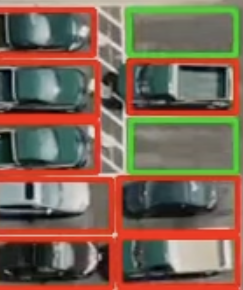

# Parking Spot Classifier (Scikit-learn)

Цей проєкт демонструє просту модель класифікації зображень паркомісць на основі `scikit-learn`, яка визначає: **чи порожнє місце для паркування, чи зайняте автомобілем**.

Модель створена на основі зображень двох категорій (`empty`, `not_empty`), і може бути інтегрована в більшу систему відеоаналізу паркінгу, де паркомісця детектяться, а ця модель класифікує кожне як зайняте або вільне.

## 🧠 Основні етапи реалізації

- Завантаження зображень із папок `empty/` та `not_empty/`
- Масштабування зображень до фіксованого розміру `(15x15)` та перетворення у вектор ознак
- Розбиття даних на навчальну та тестову вибірки
- Підбір параметрів SVM (`gamma`, `C`) за допомогою `GridSearchCV`
- Оцінка точності на тестовій вибірці
- Збереження найкращої моделі у файл `model_parking_detection.p`

## 📦 Залежності

- `numpy`, `skimage`, `scikit-learn`, `pickle`, `os`

Встановити всі залежності можна так:
```bash
pip install -r requirements.txt
```

## 🚀 Як запустити

```bash
jupyter notebook "8  Image Classification  with Sklearn.ipynb"
```

або у вигляді Python-скрипта (після адаптації до `.py`)

## 🖼 Приклад результату

> Скріншот нижче показує приклад класифікації:


## 🛠 Для чого це потрібно

Ця модель — частина більшої системи моніторингу паркінгу, де:
- Object Detection (наприклад, YOLO) виділяє зони паркомісць
- А дана модель класифікує кожне місце як **вільне** або **зайняте**

Підхід дозволяє реалізувати недорогу систему паркувального моніторингу без використання складних нейронних мереж.

## 📜 Ліцензія

MIT